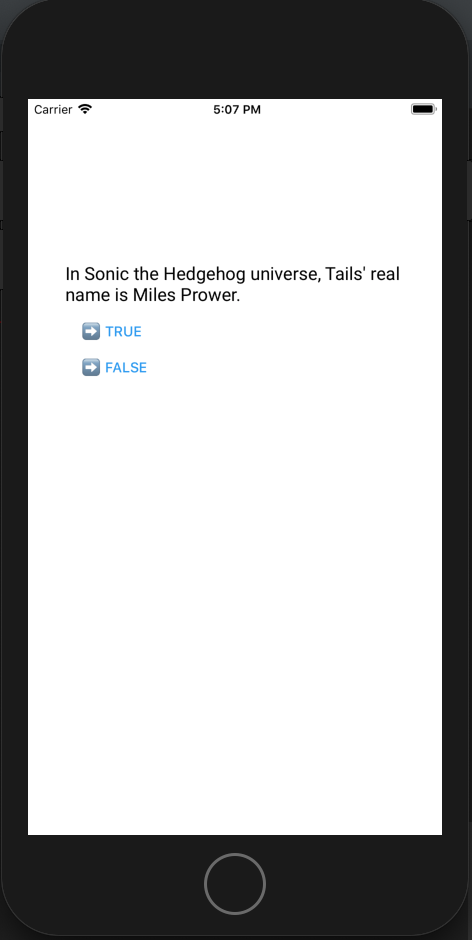
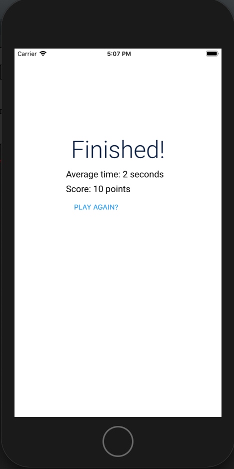

### ☘ Crowdbotics Testing App ☘

#### Installing trivia project

    git clone git@github.com:Sreng-S/cbtest.git
    cd cbtest && yarn

#### Running app

    yarn start
    or
    yarn ios, yarn android

> It's running on expo environment, so it should be review via an shared link.

Here are the results:

